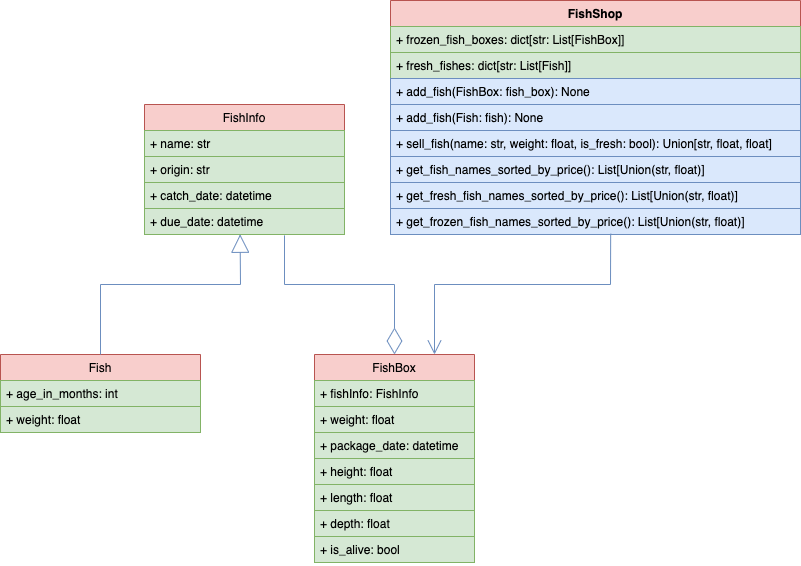
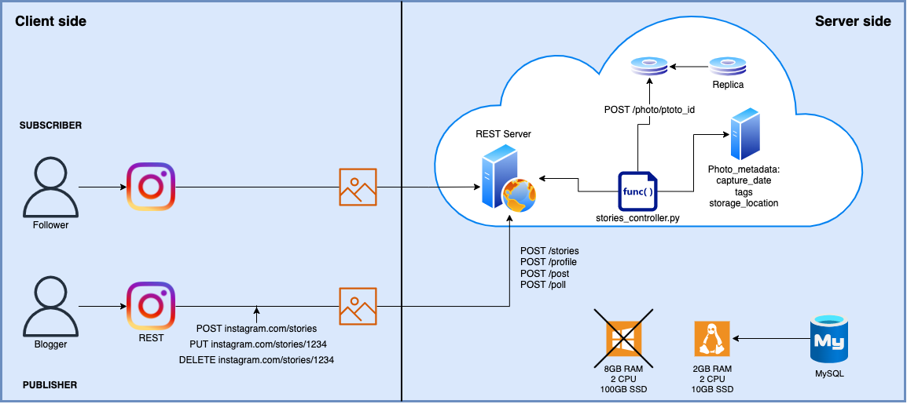

# WinterSchool [](https://github.com/andylvua/WinterSchool/actions/workflows/test.yml) [](https://www.python.org/downloads/release/python-3102/)
**This is a repository for university winter school projects with Zenoviy Veres**
> Contributed: [Oles Pasirskyi](https://github.com/wertylu)


### See also: [Flask practice. Lesson 5](#flask-practice-lesson-5)

## Fish Shop. Lesson 1-3

**To find project code, please see [FishShop.py](FishShop.py) file.**

This program provides you with a simple functionality for fish shop management.
Here you can add fish to the store, sort them as you wish,
sell them, or even cast them out if they are expired.  
Also, you can be a buyer. Haggle with the seller and see your available cash and bought fishes in a bag.

<br /> 
<br /> 

 **Fish Shop classes diagram. Created with [diagrams.net](https://www.diagrams.net/) using UML language.**
>
>

<br /> 
<br /> 

 :warning: **This program requires ```inflect``` module installation. Installation instructions is provided below.**
> 
> To check actual working version for this module please see [requirements.txt](requirements.txt).
> 
> **Remember**, you could always use 
> ``` CSS
> pip install -r requirements.txt
> ``` 
> to automatically install required version of all modules that are used in project.

<br /> 
<br /> 

 **Manual ```inflect``` module installation:**
> 
> :exclamation: Installing to your IDE. If you want to install it system-wide or just having some troubles please visit [docs.python.org](https://docs.python.org/3/installing/index.html)
>
> 
> In your environmental terminal type **```pip install inflect==<version>```**.
> 
> Notice, sometimes, you'll need to use ```pip3``` instead of ```pip```.


<br /> 
<br /> 

**Pay attention, to set your desired settings for sorting order, sorting key and maximum allowed discount in your shop please see a configuration file [config.py](config.py).**
``` python
    sorting_reverse = True 
```
_**True**_ stands for a decreasing order sort of **fish_list**, _**False**_ stands for an increasing order sort.
``` python
    sorting_key = "name" 
```
**Here**, please enter what will be the sorting key.

> :warning: The only allowed values for **sorting_key** are **_name_**, **_price_** and **_weight_**. 
> 
> Otherwise, the program will raise **ValueError**.
    
``` python   
    max_discount = 15.0
```
**This** variable is responsible for the maximum discount in percents with which you will sell fish to your customers. 

> :warning: **max_discount** value should be in range from **_0 to 100_**. 
> 
> Otherwise, the program will raise **ValueError**.
    
<br />


## Clouds. Lesson 4

**Cloud structure diagram. Represents simple explanation of how servers work and how they are managed.**
>
>

<br /> 
<br /> 

## Homework #1. Film studio
**Film studio management program structure diagram (variant 33). Created with [diagrams.net](https://www.diagrams.net/) for homework assignment.**
>
>
    
<br /> 

**[**Oles Pasirskyi**](https://github.com/wertylu) diagram. Milk shop management program structure (variant 32).**
>
>

<br /> 
<br /> 
 
## Flask practice. Lesson 5
 >On this lesson we've created a simple Flask app to demonstrate how this framework works
 
**Please see my [FlaskPractice](https://github.com/andylvua/FlaskPractice) GitHub repository.**
